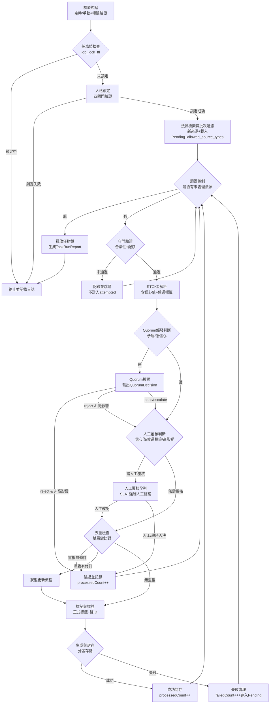

> 基於 RTCKD_SYSTEM v5.3 #Agent架構 協議開發  
> 對齊文件：《10_法律邏輯術與知識擴充引擎_v1.1.md》  
> 本次更新：v1.6.1 一致性修補，修正 `allowed_source_types` 過濾後的計數口徑，並統一其流程定位為 S3 批次過濾

---

## §1 需求確認與邊界定義（v1.6.1 修正計數口徑）

### 1.1 任務目標（不變）
為 OpenClaw 系統設計一隻**後台自動化 Agent**，每日定時（或手動觸發）執行：
- 合法法源檢索與影響力分級
- 法律邏輯解析（LAW → INFER 單向推演）
- 知識去重與狀態動態更新
- 標準化知識條目生成與合規封存

### 1.2 輸入輸出規格（v1.6.1 無調整）
| 項目 | 說明 |
|------|------|
| **輸入** | 1. 定時觸發信號（含 `run_id`、`idempotency_key`）<br>2. 手動觸發指令（含 `trigger_user`、`trigger_reason`、白名單驗證、`customSource` 選填）<br>3. 系統模組：RTCKD任務引擎、法律來源驗證規範、版本封存規則 |
| **輸出** | 1. 標準化法律知識條目（含 `KnowledgeID`、`KnowledgeKey`、`QuorumDecision`）<br>2. 標準化 `TaskRunReport`（含完整稽核欄位，計數規範見 §1.2.1）<br>3. 人工覆核佇列通知 |

#### 1.2.1 核心計數定義（v1.6.1 修正 allowed_source_types 過濾後口徑）
本規格所有計數欄位嚴格遵循以下定義，所有文件與實作完全對齊：

- **fetched_count**：本輪從官方來源**新檢索到**的法源總數（不含 Pending_Sources，且為 `allowed_source_types` 過濾前數量）
- **pending_loaded_count**：本輪從 `Pending_Sources` 載入的法源數（為 `allowed_source_types` 過濾前數量）
- **total_input_count**：本輪載入完成後的原始總輸入法源數（過濾前）  
  - 計算公式：`total_input_count = fetched_count + pending_loaded_count`
- **filtered_out_count**：本輪因 `allowed_source_types` 規則而被過濾排除的法源數
- **post_filter_input_count**：本輪經 `allowed_source_types` 過濾後，實際進入後續處理流程的法源總數  
  - 計算公式：`post_filter_input_count = total_input_count - filtered_out_count`
- **attempted_count**：成功通過守門驗證、進入 RTCKD 解析及後續處理流程的法源數
- **processed_count**：成功完成全流程、有明確處理結果的法源數（含成功封存、正式跳過、人工/超時否決的條目，不含流程中失敗的條目）  
  - 計算公式：`processed_count = attempted_count - failed_count`
- **failed_count**：進入處理流程但中途失敗、無明確結果的法源數

附註：
- `new_count`/`update_count`/`skip_count` 均基於 `attempted_count` 統計
- `skip_count` 僅統計**已進入流程後**被正式跳過的條目，不含守門前被拒的法源
- `allowed_source_types` 僅影響 `filtered_out_count` 與 `post_filter_input_count`，不回寫修改 `fetched_count`、`pending_loaded_count`、`total_input_count`

### 1.3 外部依賴與邊界（v1.6.1 無調整）
- **允許聯動**：RTCKD任務引擎.md、法律來源驗證規範.md、推論標記協議.md、版本封存規則.md
- **禁止越權**：
  - 禁止參與一般使用者法律對話
  - 禁止 INFER → LAW 反向推論
  - 禁止單日處理超過 3–5 條法源（手動任務另設獨立配額 3 條）
  - 禁止使用非指定官方來源

---

## §2 Agent 架構圖（v1.6.1 修正 allowed_source_types 流程定位）



---

## §3 工具規格清單（v1.6.1 無調整）

### Tool 1：法源檢索與分級工具
- **name**: `LegalSourceRetriever`
- **signature**: `(triggerType: "scheduled" | "manual", triggerMeta: TriggerMeta, customSource?: string) => SourceWithImpact[]`
- **description**: 
  - 內嵌 `source_preprocessor` 切片模組（規範見 §13），負責法源內容正規化與 token 控制
  - 手動觸發時，若提供 `customSource`，需先執行白名單驗證（僅限官方來源 URL）
  - 從全國法規資料庫、司法院裁判書等官方來源檢索新增/修訂法源
  - 按「高/中/低」影響力分級，優先返回高/中影響法源
  - 單次最多返回 5 條（定時）/ 3 條（手動）
- **error_handling**:
  - 檢索失敗：分散退避（5分鐘→15分鐘）；仍失敗則使用本地快取；失敗法源存入 `Pending_Sources`
  - 分級異常：標記 `preliminary_tags: ['[UNCERTAIN]']` 並觸發人工覆核
  - `customSource` 驗證失敗：直接拒絕，不進入處理流程
- **TriggerMeta Schema**（見 §8 資料模型）

### Tool 2：Quorum 投票工具
- **name**: `QuorumVoting`
- **signature**: `(parsed: ParsedLegalContent) => QuorumDecision`
- **description**:
  - 輸入：RTCKD 解析結果
  - 輸出：完整 `QuorumDecision` 結構化資料
  - 嚴格遵循 §10 投票規則執行
  - 所有投票記錄永久留存稽核日誌
- **error_handling**:
  - 投票失敗：預設返回 `final_decision: 'escalate'`，進入人工覆核

### Tool 3：RTCKD 法律解析工具
- **name**: `RTCKD_LegalParser`
- **signature**: `(source: SourceWithImpact) => ParsedLegalContent`
- **description**:
  - 輸入：已驗證法源（含雙層去重鍵、切片後的 raw_content）
  - 輸出：完整 `ParsedLegalContent`（含 `parser_confidence`、`conflict_flags`、`preliminary_tags` 候選標籤）
  - 嚴格遵循公式：`法源 → 要件 → 法律效果 → 適用條件 → 案例模式`
  - 僅負責生成**候選標籤**，不產生正式標記
- **error_handling**:
  - 解析失敗：標記 `preliminary_tags: ['[ASSUME]']` 並記錄缺口，**不進入 catch，繼續執行降級流程**
  - 邏輯矛盾：標記 `conflict_flags` 並觸發 Quorum 投票

### Tool 4：知識去重與狀態比對工具
- **name**: `KnowledgeDeduplicator`
- **signature**: `(parsed: ParsedLegalContent) => "new" | "update" | "skip"`
- **description**:
  - 基於 §12 欄位正規化規則，執行**雙層去重鍵比對**：
    - 主鍵：`source_type + canonical_source_id + article_ref + effective_date_or_version_hash`
    - 輔助鍵：`source_title_normalized + jurisdiction + issuer + amendment_note_hash`
  - 返回規則：
    - `new`：無重複，進入生成流程
    - `update`：已存在但有修訂，進入更新流程（保留跨版本不變的 `KnowledgeKey`）
    - `skip`：已存在且無變更，跳過處理
- **error_handling**:
  - 比對失敗：預設返回 `new` 並附加風險提示，同時觸發人工覆核，**不進入 catch，繼續執行降級流程**
  - 知識庫連線失敗：重試 3 次；仍失敗則終止任務並保留 `Pending_Sources`

### Tool 5：推論標記與狀態標註工具
- **name**: `InferenceTagger`
- **signature**: `(parsed: ParsedLegalContent, status: "new" | "update", quorumDecision?: QuorumDecision) => TaggedLegalContent`
- **description**:
  - 唯一正式標記生成模組：基於 `parsed.preliminary_tags` 最終確認並生成正式標籤：[LAW] / [INFER] / [ASSUME] / [UNCERTAIN]
  - 狀態標註：有效 / 修訂 / 廢止 / 爭議
  - 生成**雙ID規範**（規則見 §8）：
    - `KnowledgeID`：版本實體唯一ID
    - `KnowledgeKey`：跨版本不變的主體ID
  - 若有 `QuorumDecision`，需綁定至條目
- **error_handling**:
  - 標記遺漏：自動補 [LAW] 並記錄警告
  - ID 重複：觸發 `VersionFingerprint` 重新計算

### Tool 6：知識條目生成與封存工具
- **name**: `KnowledgeArchiver`
- **signature**: `(tagged: TaggedLegalContent, reviewStatus: "auto_pass" | "manual_pass") => FinalKnowledgeEntry`
- **description**:
  - 僅接受可封存狀態：`auto_pass`（自動通過）、`manual_pass`（人工確認通過）
  - 套用標準模板生成條目（含所有必填欄位，包含 `QuorumDecision`）
  - 同步更新舊條目狀態（若有修訂/廢止，保留完整版本鏈）
  - **分區封存規範**（見 §9）：
    - [LAW] + auto_pass/manual_pass → `official_store`
    - [INFER] + auto_pass/manual_pass → `official_store`（需強制保留來源鏈與信心值，見 §9.2）
    - [ASSUME]/[UNCERTAIN] → `staging_store` + 人工覆核通知
    - 歷史版本 → `archive_store`
    - 封存失敗 → `backup_store`
- **error_handling**:
  - 封存失敗：本地備份至 `backup_store`，稍後重試，**不進入 catch，繼續執行降級流程**
  - 模板格式錯誤：強制重置為 v1.6.1 標準格式

---

### 3.1 人格鎖定機制（v1.6.1 無調整）
「人格鎖定」為**執行上下文強制鎖**，包含四個技術閘門，每次工具呼叫前均需驗證：
| 閘門名稱 | 驗證內容 | 失敗判斷標準 | 越權驗證方式 |
|----------|----------|--------------|--------------|
| **Role Gate** | 限定系統角色為 `LegalKnowledgeEngine` | 角色標籤缺失或錯誤 | 每次工具呼叫前檢查 `current_role` 欄位 |
| **Tool Gate** | 只允許使用 §3 定義的 6 個核心工具 | 呼叫未授權工具 | 工具請求需經過 Tool Gate 攔截器 |
| **Reasoning Gate** | 只允許 `LAW → INFER` 單向推演 | 偵測到 `INFER → LAW` 反向推論 | RTCKD 解析過程中即時校驗推演方向 |
| **Output Gate** | 輸出必須符合 `FinalKnowledgeEntry` schema | 輸出缺少必填欄位或格式錯誤 | 封存前執行 schema 強制驗證 |

---

## §4 狀態機流程（v1.6.1 修正 S3 與 S5 定位）

| 狀態 ID | 狀態名稱 | 觸發條件 | 核心動作 | 轉移條件 | 失敗轉移 |
|---------|----------|----------|----------|----------|----------|
| S0 | 待機 | 系統啟動 / 上一輪任務結束 | 等待定時/手動觸發；優先加載 `Pending_Sources` | 收到觸發信號 → S1 | — |
| S1 | 任務鎖與權限驗證 | 觸發信號抵達 | 1. 檢查 `job_lock_ttl`，避免併發衝突<br>2. 手動觸發需驗證白名單與權限<br>3. 生成規範化 `idempotency_key`（使用正確命名 `source_scope`、`batch_seq`） | 通過驗證 → S2<br>鎖定中/無權限 → S13 | 驗證失敗 → S13（記錄稽核日誌） |
| S2 | 人格鎖定（四閘門） | 任務鎖獲取成功 | 執行 Role/Tool/Reasoning/Output 四閘門全量驗證 | 鎖定成功 → S3 | 鎖定失敗 → S13（釋放任務鎖） |
| S3 | 法源檢索、載入與批次過濾 | 人格鎖定完成 | 1. 呼叫 `LegalSourceRetriever` 獲取新來源<br>2. 載入 `Pending_Sources`<br>3. 統計 `fetched_count`、`pending_loaded_count`、`total_input_count`<br>4. 執行 `allowed_source_types` 批次過濾<br>5. 統計 `filtered_out_count`、`post_filter_input_count` | 完成載入與過濾 → S4 | 檢索失敗 → S13（記錄缺口） |
| S4 | 迴圈控制 | 法源載入完成 / 單條法源處理完畢 | 檢查是否有未處理法源 | 有未處理法源 → S5<br>無未處理法源 → S13 | — |
| S5 | 守門驗證與配額檢查 | 有未處理法源 | 1. 法源合法性驗證（官方來源白名單）<br>2. 手動任務配額檢查（每日 3 條）<br>3. 定時任務配額檢查（每日 5 條） | 通過驗證 → S6<br>未通過 → S12（記錄並跳過，不計入 attempted） | 驗證異常 → S12（記錄並跳過） |
| S6 | RTCKD 解析 | 法源通過守門驗證 | 1. 統計 `attempted_count`<br>2. 呼叫 `RTCKD_LegalParser`，輸出解析結果、信心值、候選標籤<br>3. 若解析失敗，標記 [ASSUME] 並繼續降級流程，不進入 catch | 解析完成 → S7 | — |
| S7 | Quorum 觸發判斷 | RTCKD 解析完成 | 判斷是否需觸發 Quorum 投票：<br>1. 存在邏輯矛盾<br>2. 解析信心值 < 0.6 | 需觸發 → S8<br>無需觸發 → S9 | — |
| S8 | Quorum 投票 | 需觸發 Quorum | 1. 呼叫 `QuorumVoting` 工具<br>2. 輸出 `QuorumDecision` 結構化資料<br>3. 記錄 `quorum_invoked = true` | `final_decision === 'reject'` 且非高影響力 → S12（跳過，計入 processed）<br>`final_decision === 'reject'` 且高影響力 → S9<br>`final_decision === 'pass'` → S9<br>`final_decision === 'escalate'` → S9 | 投票失敗 → S9（預設 escalate，進入人工覆核） |
| S9 | 人工覆核判斷 | Quorum 完成 / 無需 Quorum | 判斷是否需人工覆核（規則見 §4.1）：<br>1. `parser_confidence < 0.8`<br>2. `conflict_flags` 不為空<br>3. `preliminary_tags` 包含 `[UNCERTAIN]` 或 `[ASSUME]`<br>4. Quorum 投票結果為 `escalate`<br>5. **高影響力法源（強制人工覆核，不得跳過）**<br>6. **Quorum reject 且高影響力（強制人工覆核，不得直接跳過）** | 需人工覆核 → S10<br>無需覆核 → S11 | — |
| S10 | 人工覆核佇列 | 需人工覆核 | 1. 發送覆核通知<br>2. 記錄 `manual_review_count`<br>3. 執行 SLA 超時機制<br>4. **高影響力/效力爭議類型：不得預設否決，必須人工結案** | 人工確認通過 → S11<br>人工/超時否決 → S12（跳過，計入 processed） | 強制人工結案類型超時 → 持續通知，不轉移 |
| S11 | 去重檢查 | 人工確認通過 / 無需人工覆核 | 呼叫 `KnowledgeDeduplicator`，執行雙層鍵比對；若去重失敗，預設 `new` 並繼續降級流程，不進入 catch | `new`/`update` → S14<br>`skip` → S12（跳過，計入 processed） | — |
| S12 | 跳過/拒絕處理 | 去重判定為 skip / 人工/超時否決 / 守門失敗 / Quorum reject（非高影響力） | 1. 記錄跳過/拒絕原因<br>2. 若已進入流程，更新 `processedCount++`<br>3. 守門失敗不計入 `attempted_count` | 處理完成 → S4（下一條） | — |
| S13 | 任務結束 | 額度已滿 / 無未處理法源 / 任務整體失敗 | 1. 釋放任務鎖<br>2. 處理 `Pending_Sources`<br>3. 生成標準化 `TaskRunReport`（含所有計數欄位、`quorum_invoked`、`quorum_decisions`） | — | — |
| S14 | 標記與標註 | 去重結果返回 | 呼叫 `InferenceTagger`，生成正式標籤、雙ID、狀態標註，綁定 `QuorumDecision` | 標記完成 → S15 | 標記失敗 → S14（重試 1 次） |
| S15 | 生成與封存 | 標記完成 | 呼叫 `KnowledgeArchiver`，執行分區存儲、版本鏈更新；若封存失敗，本地備份後繼續降級流程，不進入 catch | 封存成功 → S16<br>封存失敗 → S17 | — |
| S16 | 成功封存 | 封存成功 | 1. 更新 `processedCount++`<br>2. 更新 `newCount`/`updateCount`<br>3. 記錄 `last_success_knowledge_id` | 處理完成 → S4（下一條） | — |
| S17 | 失敗處理 | 封存失敗 / 流程中失敗 | 1. 更新 `failedCount++`<br>2. 失敗法源存入 `Pending_Sources` | 處理完成 → S4（下一條） | — |

---

### 4.1 人工覆核觸發規則（v1.6.1 無調整）
滿足任一條件即進入人工覆核佇列：
1. `parser_confidence < 0.8`
2. `conflict_flags` 不為空（存在邏輯矛盾）
3. `preliminary_tags` 包含 `[UNCERTAIN]` 或 `[ASSUME]`
4. Quorum 投票結果為 `escalate`
5. **高影響力法源（強制人工覆核，不得跳過）**：憲法法庭判決、法律重大修法、民法典/刑法典核心條文修訂、統一法律見解
6. **Quorum reject 且高影響力（強制人工覆核，不得直接跳過）**：高影響力法源即使被 Quorum reject，也必須進入人工覆核，不得直接跳過

#### 4.1.1 規則優先序（v1.6.1 無調整）
當多個規則衝突時，按以下優先序執行：
1. **最高優先級**：高影響力法源相關規則（§4.1 第 5、6 條）
   - 高影響力法源不得跳過，必須進入人工覆核
   - 即使 Quorum reject，也只能轉人工覆核，不得直接跳過
2. **一般優先級**：Quorum 投票規則（§4.1 第 4 條）
3. **基礎優先級**：其他人工覆核觸發規則（§4.1 第 1-3 條）

---

## §5 異常處理清單（v1.6.1 無調整）

| 異常類型 | 觸發場景 | 處理策略（降級流程落地） | 升級條件 |
|----------|----------|--------------------------|----------|
| 法源檢索失敗 | 官方來源連線超時 / 無回應 | 分散退避（5分鐘→15分鐘）；仍失敗則使用本地快取；失敗法源存入 `Pending_Sources` | 連續 3 日失敗 → 人工介入檢查來源可用性 |
| 知識庫連線失敗 | 資料庫/存儲服務異常 | 重試 3 次；仍失敗則本地備份所有待封存條目至 `backup_store`；待處理法源存入 `Pending_Sources` | 超過 24 小時無法連線 → 系統管理員告警 |
| RTCKD 解析失敗 | 解析過程異常 | 標記 `preliminary_tags: ['[ASSUME]']` 並記錄缺口，**不進入 catch**，繼續執行降級流程，僅可進入 `staging_store` | 連續 3 次解析失敗 → 人工檢查法源格式 |
| 知識去重失敗 | 去重比對過程異常 | 預設返回 `new` 並附加風險提示，同時觸發人工覆核，**不進入 catch**，繼續執行降級流程 | 連續 3 次去重失敗 → 人工檢查正規化規則 |
| 推論邏輯矛盾 | RTCKD 解析偵測到 LAW→INFER 以外的推演方向 | 觸發 Quorum 投票；若為高影響力法源，即使 Quorum reject 也必須進入人工覆核；若非高影響力法源且 Quorum reject 則直接跳過處理 | 投票否決且非高影響力 → 進入 S12 跳過處理 |
| 單日額度超限 | 待處理法源超過上限 | 強制截斷，剩餘法源自動存入 `Pending_Sources`，排入次日任務 | 連續 2 日超限 → 檢查影響力分級規則合理性 |
| 狀態更新異常 | 舊條目與新法源版本衝突 | 保留新舊兩版（舊版進入 `archive_store`），標記修訂前後差異 | 衝突涉及效力爭議 → 標記 [爭議] 並進入人工覆核 |
| 任務鎖衝突 | 前一輪任務未結束，新一輪觸發 | 直接終止新一輪任務，記錄 `job_lock_conflict` | 連續 3 次鎖衝突 → 檢查任務執行時長是否異常 |
| 人格鎖定失敗 | 四閘門任一未通過 | 立即終止任務，釋放任務鎖，記錄詳細失敗原因 | 連續 2 次鎖定失敗 → 人工檢查系統配置 |
| 封存失敗 | 生成與封存過程異常 | 本地備份至 `backup_store`，稍後重試，**不進入 catch**，繼續執行降級流程，失敗法源存入 `Pending_Sources` | 連續 3 次封存失敗 → 人工檢查存儲服務 |

---

## §6 可直接使用的偽代碼模板（v1.6.1 修正計數口徑與流程定位）

（基於 Node.js + node-cron + OpenClaw 模組接口，完全對應規格定義，無歧義）

```javascript
// 引入依賴
const cron = require('node-cron');
const { v4: uuidv4 } = require('uuid');
const { createHash } = require('crypto');
const { 
  LegalSourceRetriever, 
  QuorumVoting,
  RTCKD_LegalParser, 
  KnowledgeDeduplicator, 
  InferenceTagger, 
  KnowledgeArchiver,
  RoleGate, ToolGate, ReasoningGate, OutputGate
} = require('openclaw-modules');
const { logTask, logError, logWarning, logAudit } = require('openclaw-logger');
const { acquireJobLock, releaseJobLock } = require('openclaw-job-lock');
const { validateManualTriggerWhitelist, validateCustomSourceUrl, checkManualQuota, validateAllowedSourceTypes } = require('openclaw-permissions');

// 常數定義
const DAILY_LIMIT_SCHEDULED = 5;
const DAILY_LIMIT_MANUAL = 3;
const SCHEDULE = '0 2 * * *'; // 每日凌晨 2 點執行
const JOB_LOCK_TTL = 4 * 60 * 60 * 1000; // 4 小時鎖定時長
const PARSER_CONFIDENCE_THRESHOLD = 0.8;
const QUORUM_CONFIDENCE_THRESHOLD = 0.6;
const MANUAL_REVIEW_SLA = 24 * 60 * 60 * 1000; // 24小時SLA
const HIGH_IMPACT_FORCE_REVIEW = true; // 高影響力法源強制人工覆核

// 人工覆核決策完整列舉
const ReviewDecision = Object.freeze({
  AUTO_PASS: 'auto_pass',
  MANUAL_PASS: 'manual_pass',
  MANUAL_REJECT: 'manual_reject',
  TIMEOUT_REJECT: 'timeout_reject'
});

// 主任務函數
async function runLegalKnowledgeExpansion(triggerType = 'scheduled', triggerMeta = {}, customSource = null) {
  // 任務啟動時即記錄開始時間
  const startedAt = new Date().toISOString();
  const runId = uuidv4();
  
  // 強化：冪等鍵生成規則，使用正確命名 source_scope、batch_seq
  const dateStr = new Date().toISOString().split('T')[0];
  const sourceScope = triggerMeta.source_scope || 'all';
  const triggerUser = triggerMeta.trigger_user || 'system';
  const batchSeq = triggerMeta.batch_seq || '01';
  const purpose = triggerMeta.purpose || 'daily_sync';
  const idempotencyRaw = `${triggerType}-${dateStr}-${sourceScope}-${triggerUser}-${batchSeq}-${purpose}`;
  const idempotencyKey = createHash('sha256').update(idempotencyRaw).digest('hex').slice(0, 16);
  
  logTask(`[${triggerType}] 任務啟動`, { runId, idempotencyKey, startedAt, customSource: customSource ? 'provided' : 'none' });
  
  // 狀態變數初始化（v1.6.1 修正計數口徑）
  let jobLock = null;
  let fetchedCount = 0;
  let pendingLoadedCount = 0;
  let totalInputCount = 0;      // 過濾前
  let filteredOutCount = 0;     // v1.6.1 新增
  let postFilterInputCount = 0; // v1.6.1 新增
  let attemptedCount = 0;
  let processedCount = 0;
  let newCount = 0;
  let updateCount = 0;
  let skipCount = 0;
  let failedCount = 0;
  let manualReviewCount = 0;
  let quorumInvoked = false;
  const quorumDecisions = [];
  const fallbackEvents = [];
  const backupEntries = [];
  let lastSuccessKnowledgeId = null;
  const pendingSources = [];

  try {
    // S1: 任務鎖與權限驗證
    if (triggerType === 'manual') {
      const hasPermission = await validateManualTriggerWhitelist(triggerMeta);
      if (!hasPermission) throw new Error('手動觸發權限驗證失敗');
      
      // 手動配額檢查
      const hasQuota = await checkManualQuota(triggerUser, DAILY_LIMIT_MANUAL);
      if (!hasQuota) throw new Error('手動任務每日配額已用完');
      
      // customSource 驗證
      if (customSource) {
        const isValidSource = await validateCustomSourceUrl(customSource);
        if (!isValidSource) throw new Error('customSource 僅限官方來源 URL');
      }
      
      logAudit('手動觸發權限驗證通過', { triggerUser, customSource: customSource ? 'provided' : 'none' });
    }
    
    jobLock = await acquireJobLock('legal-knowledge-expansion', JOB_LOCK_TTL, idempotencyKey);
    if (!jobLock) throw new Error('任務鎖獲取失敗，前一輪任務可能仍在執行');

    // S2: 人格鎖定（四閘門驗證）
    const personaLocked = await lockPersona('LegalKnowledgeEngine');
    if (!personaLocked) throw new Error('人格鎖定失敗');

    // S3: 法源檢索、載入與批次過濾（v1.6.1 修正流程定位）
    const pendingSourcesFromLastRun = await loadPendingSources();
    pendingLoadedCount = pendingSourcesFromLastRun.length;

    const newSources = await LegalSourceRetriever(triggerType, triggerMeta, customSource);
    fetchedCount = newSources.length;

    // v1.6.1：先記錄過濾前總量
    totalInputCount = pendingLoadedCount + fetchedCount;

    // v1.6 新增：allowed_source_types 過濾
    let filteredSources = [...pendingSourcesFromLastRun, ...newSources];
    if (triggerMeta.allowed_source_types && triggerMeta.allowed_source_types.length > 0) {
      const originalCount = filteredSources.length;
      filteredSources = await validateAllowedSourceTypes(
        filteredSources,
        triggerMeta.allowed_source_types
      );
      filteredOutCount = originalCount - filteredSources.length;

      logTask('已過濾 allowed_source_types', {
        originalCount,
        filteredCount: filteredSources.length,
        filteredOutCount
      });
    }

    const sources = filteredSources;
    postFilterInputCount = sources.length;

    logTask('法源載入完成', {
      fetchedCount,
      pendingLoadedCount,
      totalInputCount,
      filteredOutCount,
      postFilterInputCount
    });

    if (postFilterInputCount === 0) {
      logTask('無待處理法源，任務結束');
      return;
    }

    // S4-S17: 逐條處理法源（對齊架構圖與狀態機：人工覆核在前，去重在後）
    let currentSourceIndex = 0;
    while (currentSourceIndex < sources.length) {
      const source = sources[currentSourceIndex];
      currentSourceIndex++;
      
      // 檢查配額
      const dailyLimit = triggerType === 'manual' ? DAILY_LIMIT_MANUAL : DAILY_LIMIT_SCHEDULED;
      if (processedCount >= dailyLimit) {
        // 額度超限，剩餘法源存入Pending_Sources
        pendingSources.push(source, ...sources.slice(currentSourceIndex));
        logWarning('單日額度已滿，剩餘法源排入次日', { pendingSourcesCount: pendingSources.length });
        break;
      }

      try {
        // S5: 守門驗證與配額檢查（v1.6.1 移除 allowed_source_types）
        const gatePassed = await validateSourceLegality(source);
        if (!gatePassed) {
          logTask(`跳過非法法源：${source.canonical_source_id}（不計入attempted）`);
          continue; // 不計入 attempted，直接下一條
        }
        attemptedCount++;

        // S6: RTCKD 解析（降級策略落地：不進入 catch）
        let parsed;
        try {
          parsed = await RTCKD_LegalParser(source);
        } catch (parseErr) {
          logWarning(`RTCKD 解析失敗，執行降級策略：${source.canonical_source_id}`, parseErr);
          fallbackEvents.push({
            type: 'parser_failure',
            source_id: source.canonical_source_id,
            error: parseErr.message
          });
          parsed = {
            source_meta: source,
            legal_issue: '',
            elements: [],
            legal_effect: '',
            applicability_conditions: [],
            case_patterns: [],
            reasoning_skeleton: '',
            citations: [],
            parser_confidence: 0.0,
            assumption_flags: ['解析失敗，降級處理'],
            conflict_flags: [],
            preliminary_tags: ['[ASSUME]']
          };
        }

        // S7: Quorum 觸發判斷
        let quorumDecision = null;
        const needQuorum = 
          parsed.parser_confidence < QUORUM_CONFIDENCE_THRESHOLD ||
          parsed.conflict_flags.length > 0;

        if (needQuorum) {
          quorumInvoked = true;
          logTask(`觸發 Quorum 投票：${source.canonical_source_id}`);
          try {
            quorumDecision = await QuorumVoting(parsed);
            quorumDecisions.push({
              source_id: source.canonical_source_id,
              decision: quorumDecision
            });
          } catch (quorumErr) {
            logWarning(`Quorum 投票失敗，預設 escalate：${source.canonical_source_id}`, quorumErr);
            quorumDecision = {
              invoked: true,
              trigger_reason: 'Quorum 投票失敗',
              tecton_vote: 'pass',
              iris_vote: 'pass',
              axiom_vote: 'pass',
              final_decision: 'escalate',
              dissent_log: ['Quorum 投票失敗，預設 escalate'],
              decided_at: new Date().toISOString()
            };
            quorumDecisions.push({
              source_id: source.canonical_source_id,
              decision: quorumDecision
            });
          }
        }

        // v1.6.1 新增：Quorum reject 與高影響力的規則優先序
        const isHighImpact = source.impact_score === 'HIGH';
        if (quorumDecision && quorumDecision.final_decision === 'reject') {
          if (isHighImpact) {
            // 高影響力優先：Quorum reject 也必須進入人工覆核，不得直接跳過
            logTask(`高影響力法源 Quorum reject，轉人工覆核：${source.canonical_source_id}`);
            // 繼續往下走，進入人工覆核判斷
          } else {
            // 非高影響力：Quorum reject 直接跳過
            skipCount++;
            processedCount++;
            logTask(`Quorum 否決，跳過處理：${source.canonical_source_id}`);
            continue;
          }
        }

        // S9: 人工覆核判斷（補全高影響力法源與規則優先序）
        let reviewStatus = ReviewDecision.AUTO_PASS;
        let needManualReview = 
          parsed.parser_confidence < PARSER_CONFIDENCE_THRESHOLD ||
          parsed.conflict_flags.length > 0 ||
          parsed.preliminary_tags.includes('[UNCERTAIN]') ||
          parsed.preliminary_tags.includes('[ASSUME]') ||
          (quorumDecision && quorumDecision.final_decision === 'escalate') ||
          (HIGH_IMPACT_FORCE_REVIEW && isHighImpact) ||
          (quorumDecision && quorumDecision.final_decision === 'reject' && isHighImpact);

        if (needManualReview) {
          manualReviewCount++;
          logTask(`進入人工覆核佇列：${source.canonical_source_id}`);
          
          // 等待人工覆核（含超時處理與強制人工結案）
          const isForceManualReview = isHighImpact || parsed.preliminary_tags.includes('[UNCERTAIN]');
          reviewStatus = await waitForManualReview(parsed, isForceManualReview);
          
          if (reviewStatus === ReviewDecision.MANUAL_REJECT || reviewStatus === ReviewDecision.TIMEOUT_REJECT) {
            skipCount++;
            processedCount++;
            logTask(`人工/超時否決：${source.canonical_source_id}`);
            continue;
          }
        }

        // S11: 去重檢查（v1.6.1 調整順序：人工覆核在前，去重在後）
        let deduplicateResult;
        try {
          deduplicateResult = await KnowledgeDeduplicator(parsed);
        } catch (dedupErr) {
          logWarning(`去重檢查失敗，執行降級策略（預設new + 人工覆核）：${source.canonical_source_id}`, dedupErr);
          fallbackEvents.push({
            type: 'dedup_failure',
            source_id: source.canonical_source_id,
            error: dedupErr.message
          });
          deduplicateResult = 'new';
          // 去重失敗後重新進入人工覆核
          manualReviewCount++;
          logTask(`去重失敗，重新進入人工覆核：${source.canonical_source_id}`);
          const isForceManualReview = true;
          reviewStatus = await waitForManualReview(parsed, isForceManualReview);
          
          if (reviewStatus === ReviewDecision.MANUAL_REJECT || reviewStatus === ReviewDecision.TIMEOUT_REJECT) {
            skipCount++;
            processedCount++;
            logTask(`人工/超時否決：${source.canonical_source_id}`);
            continue;
          }
        }

        if (deduplicateResult === 'skip') {
          skipCount++;
          processedCount++;
          logTask(`跳過重複法源：${source.canonical_source_id}`);
          continue;
        }

        // S14: 標記與標註
        const tagged = await InferenceTagger(parsed, deduplicateResult, quorumDecision);
        
        // S15: 生成與封存（降級策略落地：不進入 catch）
        let finalEntry;
        try {
          finalEntry = await KnowledgeArchiver(tagged, reviewStatus);
        } catch (archiveErr) {
          logWarning(`封存失敗，執行降級策略：${source.canonical_source_id}`, archiveErr);
          fallbackEvents.push({
            type: 'archive_failure',
            source_id: source.canonical_source_id,
            error: archiveErr.message
          });
          // 降級策略：本地備份 + 存入Pending + failedCount++
          failedCount++;
          backupEntries.push(source.canonical_source_id);
          pendingSources.push(source);
          logTask(`封存失敗，存入Pending：${source.canonical_source_id}`);
          continue;
        }
        
        // S16: 成功封存
        logTask(`成功封存：${finalEntry.KnowledgeID}`);
        processedCount++;
        if (deduplicateResult === 'new') newCount++;
        if (deduplicateResult === 'update') updateCount++;
        lastSuccessKnowledgeId = finalEntry.KnowledgeID;
      } catch (err) {
        // 僅處理真正的致命錯誤，其餘降級策略已在各階段處理
        failedCount++;
        logError(`處理法源失敗（致命錯誤）：${source.canonical_source_id}`, err);
        pendingSources.push(source);
      }
    }
  } catch (err) {
    logError('任務整體失敗', err);
  } finally {
    // 任務完全結束時記錄結束時間
    const endedAt = new Date().toISOString();
    
    // S13: 釋放任務鎖、保存Pending_Sources、生成標準化報告
    if (jobLock) await releaseJobLock(jobLock);
    await savePendingSources(pendingSources);
    
    const taskReport = generateTaskRunReport({
      run_id: runId,
      trigger_type: triggerType,
      trigger_user: triggerMeta.trigger_user || null,
      trigger_reason: triggerMeta.trigger_reason || null,
      start_time: startedAt,
      end_time: endedAt,
      fetched_count: fetchedCount,
      pending_loaded_count: pendingLoadedCount,
      total_input_count: totalInputCount,
      filtered_out_count: filteredOutCount,
      post_filter_input_count: postFilterInputCount,
      attempted_count: attemptedCount,
      processed_count: processedCount,
      new_count: newCount,
      update_count: updateCount,
      skip_count: skipCount,
      failed_count: failedCount,
      fallback_used: fallbackEvents.length > 0,
      fallback_events: fallbackEvents,
      quorum_invoked: quorumInvoked,
      quorum_decisions: quorumDecisions,
      quorum_summary: {
        total: quorumDecisions.length,
        passed: quorumDecisions.filter(d => d.decision.final_decision === 'pass').length,
        rejected: quorumDecisions.filter(d => d.decision.final_decision === 'reject').length,
        escalated: quorumDecisions.filter(d => d.decision.final_decision === 'escalate').length
      },
      manual_review_count: manualReviewCount,
      pending_sources_count: pendingSources.length,
      backup_entry_count: backupEntries.length,
      last_success_knowledge_id: lastSuccessKnowledgeId,
      idempotency_key: idempotencyKey
    });
    
    logTask('任務結束', taskReport);
    return taskReport;
  }
}

// 人格鎖定輔助函數（四閘門完整實作）
async function lockPersona(personaName) {
  const rolePassed = await RoleGate(personaName);
  const toolPassed = await ToolGate([
    'LegalSourceRetriever', 
    'QuorumVoting',
    'RTCKD_LegalParser', 
    'KnowledgeDeduplicator', 
    'InferenceTagger', 
    'KnowledgeArchiver'
  ]);
  const reasoningPassed = await ReasoningGate('LAW_TO_INFER');
  const outputPassed = await OutputGate('FinalKnowledgeEntry');
  
  if (!rolePassed || !toolPassed || !reasoningPassed || !outputPassed) {
    logError('人格鎖定失敗', { rolePassed, toolPassed, reasoningPassed, outputPassed });
    return false;
  }
  
  logTask('人格鎖定成功');
  return true;
}

// 生成標準化任務報告
function generateTaskRunReport(fields) {
  return fields;
}

// 輔助函數（規範化實作）
async function validateSourceLegality(source) { /* 實作略 */ return true; }
async function waitForManualReview(parsed, isForceManualReview) { /* 實作略 */ return ReviewDecision.MANUAL_PASS; }
async function loadPendingSources() { /* 實作略 */ return []; }
async function savePendingSources(sources) { /* 實作略 */ return; }

// 啟動定時任務（指定時區）
cron.schedule(SCHEDULE, () => runLegalKnowledgeExpansion('scheduled'), {
  timezone: 'Asia/Taipei'
});

// 匯出手動觸發接口
module.exports = { runLegalKnowledgeExpansion, ReviewDecision };
```

---

## §7 狀態繼承規則（v1.6.1 無調整）

### STATE_PACK 欄位擴充（完全對應規格）
```json
{
  "Current_Role": "LegalKnowledgeEngine",
  "Active_Logic": "LAW→INFER 單向推演",
  "Prohibited_Style": "自由推論、越權對話",
  
  "Current_Tier_Level": 2,
  "Quorum_Triggered": false,
  "Last_Quorum_Decisions": [],
  
  "Fetched_Count": 0,
  "Pending_Loaded_Count": 0,
  "Total_Input_Count": 0,
  "Filtered_Out_Count": 0,
  "Post_Filter_Input_Count": 0,
  "Attempted_Count": 0,
  "Processed_Count": 0,
  "Daily_Limit_Scheduled": 5,
  "Daily_Limit_Manual": 3,
  "Pending_Sources": [],
  "Backup_Entries": [],
  
  "Last_Run_Date": "2026/03/06",
  "Last_Run_Id": "xxx-xxx-xxx",
  "Last_Run_Idempotency_Key": "xxx",
  "Last_Success_Knowledge_ID": "STATUTE-CIVIL-000153-001-abc12345",
  "Last_Success_Knowledge_Key": "STATUTE-CIVIL-000153-001",
  "Error_Log": [],
  
  "Job_Lock_Held": false,
  "Job_Lock_TTL": 0
}
```

### 跨輪繼承觸發規則
- 任務中斷時自動保存 `Pending_Sources`、`Backup_Entries`、`Last_Quorum_Decisions` 與任務鎖狀態
- 下次啟動時優先處理 `Pending_Sources`，再處理當日新增法源
- 可通過 `#state` 手動查詢當前狀態

---

## §8 資料模型規格（v1.6.1 補全計數欄位）

### 8.1 核心列舉定義（v1.6.1 無調整）
```typescript
// 人工覆核決策完整列舉
enum ReviewDecision {
  AUTO_PASS = "auto_pass",
  MANUAL_PASS = "manual_pass",
  MANUAL_REJECT = "manual_reject",
  TIMEOUT_REJECT = "timeout_reject"
}

// 法源類型列舉
enum SourceType {
  STATUTE = "STATUTE",
  JUDGMENT = "JUDGMENT",
  REGULATION = "REGULATION",
  ADMIN_INTERPRETATION = "ADMIN_INTERPRETATION"
}

// 法源狀態列舉
enum SourceStatus {
  VALID = "有效",
  AMENDED = "修訂",
  REPEALED = "廢止",
  DISPUTED = "爭議"
}

// 管轄區列舉
enum Jurisdiction {
  TAIWAN = "TAIWAN",
  LOCAL = "LOCAL"
}
```

### 8.2 雙ID規範（v1.6.1 無調整）
- **KnowledgeID（版本實體唯一ID）**：`[SourceType]-[Jurisdiction]-[CanonicalSourceCode]-[Locator]-[VersionFingerprint]`
  - 範例：`STATUTE-TAIWAN-000153-001-abc12345`
  - 用途：單一版本條目的唯一識別，用於封存與版本追溯
- **KnowledgeKey（跨版本主體ID）**：`[SourceType]-[Jurisdiction]-[CanonicalSourceCode]-[Locator]`
  - 範例：`STATUTE-TAIWAN-000153-001`
  - 用途：同一法源跨版本的唯一識別，用於修訂鏈與狀態更新

### 8.3 完整介面定義（v1.6.1 補全計數欄位）
```typescript
// 手動觸發中繼資料（修正命名：source_scope、batch_seq）
interface TriggerMeta {
  trigger_user: string;          // 觸發人（需白名單驗證）
  trigger_reason: string;        // 觸發原因
  trigger_time: string;          // 觸發時間（ISO 8601）
  source_scope?: string;         // 法源範圍（修正命名）
  batch_seq?: string;            // 批次序號（修正命名）
  purpose?: string;              // 執行目的
  allowed_source_types?: SourceType[]; // 允許的法源類型
}

// 其餘介面定義與 v1.6 相同，此處省略重複

// 標準化任務報告模型（v1.6.1 補全計數欄位）
interface TaskRunReport {
  run_id: string;
  trigger_type: 'scheduled' | 'manual';
  trigger_user?: string;
  trigger_reason?: string;
  start_time: string;
  end_time: string;
  fetched_count: number;
  pending_loaded_count: number;
  total_input_count: number;
  filtered_out_count: number;
  post_filter_input_count: number;
  attempted_count: number;
  processed_count: number;
  new_count: number;
  update_count: number;
  skip_count: number;
  failed_count: number;
  fallback_used: boolean;
  fallback_events: FallbackEvent[];
  quorum_invoked: boolean;
  quorum_decisions: QuorumDecisionWithSource[];
  quorum_summary: QuorumSummary;
  manual_review_count: number;
  pending_sources_count: number;
  backup_entry_count: number;
  last_success_knowledge_id?: string;
  idempotency_key: string;
}
```

---

## §9 封存分區規則（v1.6.1 無調整）

### 9.1 四層分區存儲規範
| 分區名稱 | 用途 | 存入條件 | 存取限制 |
|----------|------|----------|----------|
| `official_store` | 正式生效知識條目 | 1. [LAW] + auto_pass/manual_pass<br>2. [INFER] + auto_pass/manual_pass（需符合 §9.2 限制） | 可被前端業務模組讀取 |
| `staging_store` | 待確認/半成品條目 | [ASSUME]/[UNCERTAIN] + 需人工覆核 | 僅後台管理員可見，不對外開放 |
| `archive_store` | 歷史版本/廢止條目 | 修訂後的舊版、已廢止法源 | 僅用於追溯查詢，不對外提供 |
| `backup_store` | 封存失敗暫存 | 封存失敗的條目、本地備份 | 僅系統維護人員可見 |

#### 9.2 [INFER] 入庫強制限制（v1.6.1 無調整）
1. **入庫必要條件**：[INFER] 內容進入 `official_store` 時，必須強制綁定對應的 [LAW] 來源鏈、`parser_confidence` 信心值、完整 `reasoning_skeleton` 推演骨架，缺一不可
2. **前端展示限制**：[INFER] 內容必須與 [LAW] 內容明顯區分，不得同級呈現，必須標註「本內容為法律推論，非原始法源」字樣，並提供原始法源的跳轉連結
3. **獨立性限制**：[INFER] 內容不得作為單獨的知識條目入庫，必須依附於對應的 [LAW] 法源條目之下

---

## §10 Quorum 投票機制詳細規格（v1.6.1 無調整）

### 10.1 觸發條件（v1.6.1 無調整）
- RTCKD 解析偵測到邏輯矛盾
- 解析信心值低於 0.6
- 法源效力存在重大爭議

### 10.2 投票成員與職責（v1.6.1 無調整）
| 成員名稱 | 角色 | 審查維度 | 否決權 |
|----------|------|----------|--------|
| **TECTON** | 工程 | 結構一致性、Schema 正確性 | 無（僅提供建議） |
| **IRIS** | 策略 | 來源可信度、影響力分級合理性 | 有（來源不可信時一票否決） |
| **AXIOM** | 邏輯 | 法理方向一致性、推演方向正確性 | 有（邏輯矛盾時一票否決） |

### 10.3 投票規則（v1.6.1 無調整）
- 票型：`pass` / `reject` / `escalate`（需人工覆核）
- 通過條件：全員 `pass` 或僅 TECTON 反對
- 否決條件：IRIS 或 AXIOM 投 `reject`
-  escalate 條件：任一成員投 `escalate` 或票數分歧
- 所有投票必須保留 `dissent_log` 不同意見記錄，存入稽核日誌

#### 10.3.1 投票結果與規則優先序（v1.6.1 無調整）
當投票結果與其他規則衝突時，按以下優先序執行：
1. **最高優先級**：高影響力法源規則
   - 高影響力法源即使被 Quorum reject，也必須進入人工覆核，不得直接跳過
2. **一般優先級**：Quorum 投票結果
   - 非高影響力法源且 Quorum reject → 直接跳過處理
   - Quorum pass/escalate → 繼續後續流程

### 10.4 輸出模型（v1.6.1 無調整）
強制輸出 `QuorumDecision` 結構化資料（定義見 §8.3），隨法源資料全流程傳遞，最終存入知識條目與任務報告。

---

## §11 手動觸發權限模型（v1.6.1 修正 allowed_source_types 定位）

### 11.1 白名單機制（v1.6.1 無調整）
- 僅允許名單內的 `trigger_user` 發起手動觸發
- 白名單由系統管理員維護，記錄於 `openclaw-permissions` 模組
- 所有操作永久留存稽核日誌

### 11.2 來源與配額限制（v1.6.1 定位修正）
- 手動觸發僅允許指定 `source_type`（預設：`STATUTE`、`JUDGMENT`）
- 若提供 `customSource`，必須先執行白名單驗證（僅限官方來源 URL），禁止未經驗證的 URL
- 手動任務每日獨立配額：3 條法源，不占用定時任務配額
- 超過配額需系統管理員審批
- **allowed_source_types 落地**（v1.6.1 定位修正）：
  - `allowed_source_types` 屬於 **S3 法源檢索與載入後的批次過濾規則**
  - 在 `LegalSourceRetriever` 返回法源，且 `Pending_Sources` 載入完成後，立即執行批次過濾
  - 僅保留 `triggerMeta.allowed_source_types` 中指定的法源類型
  - 若未指定 `allowed_source_types`，則保留所有法源類型
  - 過濾前總數、過濾排除數、過濾後總數，均需記錄於稽核日誌
  - 該規則不屬於 S5 單條守門驗證，不影響 `fetched_count`、`pending_loaded_count`、`total_input_count` 的原始載入口徑

---

## §12 欄位正規化規則（v1.6.1 無調整）
本規則為強制規範，所有工程實作必須嚴格遵循，確保去重結果無歧義：

### 12.1 基礎正規化規則（v1.6.1 無調整）
- 全形字元轉半形：數字、英文字母、符號統一轉換為半形
- 正體字統一：使用台灣標準正體字，避免簡體字、異體字
- 去除多餘字元：去除首尾空格、換行符、無意義特殊符號
- 日期格式：所有日期統一使用 ISO 8601 格式（`YYYY-MM-DD`）

### 12.2 關鍵欄位正規化（v1.6.1 無調整）
1. **canonical_source_id**
   - 法規：使用全國法規資料庫的「法規編號」，例如「0000000153」
   - 裁判書：使用裁判字號正規化結果，例如「最高法院112年度台上字第1234號」轉為「TPS-112-台上-1234」
   - 行政函釋：使用發文機關+發文字號，例如「法務部112法律字第123456號」轉為「MOJ-112-法律-123456」

2. **source_title_normalized**
   - 去除「中華民國」「令」「規則」以外的多餘修飾詞
   - 統一條號格式，例如「民法第一百五十三條」轉為「民法第153條」
   - 範例：「中華民國民法第一百五十三條」正規化為「民法第153條」

3. **article_ref**
   - 中文條號轉數字格式：「第一百五十三條之一」轉為「015301」
   - 無條號的裁判/函釋：填寫「NA」
   - 不足三位數的條號前面補0，例如「第5條」轉為「000500」

4. **effective_date_or_version_hash**
   - 優先使用法源生效日期（ISO 8601格式）
   - 無明確生效日期的，使用 SHA-256 計算法源原文前1000字元的雜湊值，取前8位
   - 範例：`2024-01-01` 或 `abc12345`

5. **amendment_note_hash**
   - 使用 SHA-256 計算修正說明全文的雜湊值，取前8位
   - 無修正說明的，填寫與 `effective_date_or_version_hash` 相同的值

---

## §13 來源抓取與內容切片規則（v1.6.1 無調整）

### 13.1 負責模組（v1.6.1 無調整）
`source_preprocessor`，隸屬於 `LegalSourceRetriever` 的前置處理階段，所有法源必須經過本模組處理後才可進入 RTCKD 解析。

### 13.2 Token 上限規範（v1.6.1 無調整）
- 單次輸入 `raw_content` 嚴格控制 ≤6000 tokens
- 超過上限的內容必須按語義切片，禁止強制截斷
- 多切片內容按序處理，同一法源的多個切片共用同一 `canonical_source_id`

### 13.3 不同法源類型的抓取規則（v1.6.1 無調整）
1. **法規類型**
   - 優先抓取：完整條文正文、修正說明、生效日期、立法理由
   - 捨棄：無關附錄、歷史修法記錄（除本次修訂外）
   - 超過token時：優先保留條文正文、本次修訂前後對照

2. **裁判書類型**
   - 優先抓取：裁判字號、主文、裁判理由、爭點摘要
   - 捨棄：當事人基本資料、附錄、證據清單
   - 超過token時：優先保留裁判理由、主文、爭點摘要

3. **行政函釋類型**
   - 優先抓取：發文機關、發文字號、主旨、解釋內容、生效日期
   - 捨棄：內部流程簽核記錄
   - 超過token時：優先保留主旨、解釋內容

---

## §14 Pending_Sources 重跑策略（v1.6.1 無調整）

### 14.1 重跑優先順序（v1.6.1 無調整）
1. 前次處理失敗的高影響力法源
2. 前次額度超限剩餘的高影響力法源
3. 前次處理失敗的中影響力法源
4. 前次額度超限剩餘的中影響力法源
5. 低影響力法源（僅閒置時段處理）

### 14.2 保留與重跑限制（v1.6.1 無調整）
- 最大保留天數：最多保留30天，超過30天的自動清除，重新從官方來源檢索
- 重跑次數限制：同一法源連續重跑3次失敗的，自動轉入人工覆核佇列，不再自動重跑
- 配額規則：重跑的法源占用當日處理配額，每日優先處理 `Pending_Sources`，再處理當日新增法源

---

## §15 人工覆核 SLA 與超時策略（v1.6.1 無調整）

### 15.1 標準 SLA 規範（v1.6.1 無調整）
- 工作日：24小時內完成覆核
- 例假日/國定假日：順延至次一工作日
- 高影響力法源（憲法法庭判決、法律重大修法）：優先處理，SLA 縮短為 12 小時

### 15.2 超時處理規則（v1.6.1 無調整）
- 一般類型法源：超過 SLA 未處理的，預設 `timeout_reject`，跳過處理，記錄稽核日誌
- 強制人工結案類型：高影響力法源、涉及效力爭議的法源，不得預設否決，必須人工結案，每 6 小時重發一次通知
- 重新送審規則：人工否決的條目，補充新的法源資料後可重新送審，重新計算 SLA；同一條目最多重新送審 2 次，超過後必須人工結案

### 15.3 通知與稽核（v1.6.1 無調整）
- 通知管道：系統內部告警、Email 通知指定管理員、企業通訊軟體群組通知（可配置）
- 稽核記錄：所有人工覆核操作，必須記錄覆核人、覆核時間、覆核決定、覆核備註，永久留存稽核日誌

---

**文件版本**：v1.6.1（正式生產版，一致性修補完成）  
**生成日期**：2026/03/06  
**適用平台**：OpenClaw + Node.js 環境  
**審計狀態**：已完成 v1.6.1 一致性修補，修正 `allowed_source_types` 過濾後的計數口徑，並統一其流程定位為 S3 批次過濾；規格、流程圖、狀態機與偽代碼已對齊，可進入正式生產部署
